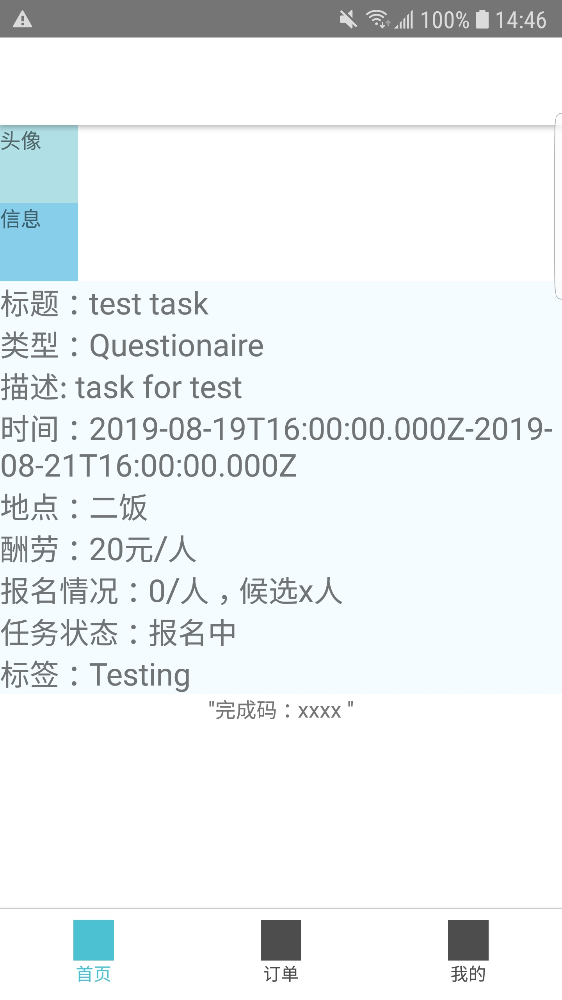

# What I learn in practice

- About the cascading of **style**

I happened to meet a problem that the layout of my RN project won't perform as I expected. 

As shown above, I wanted the 头像 and 信息 container to be arranged in row. But no matter how I tried, they still stay the same. After I double checked the **style** of the container of them, I suddenly realize the problem —— it was due to the cascading of **style**.

```flexDirection of column will cover the deine in 
<View style={styles.organizerInfoContainer, {display: this.state.display}}>
  <View style={styles.organizerProfilePicContainer}>
    <Text>头像</Text>
  </View>
  <View style={styles.organizerProfileTextContainer}>
    <Text>信息</Text>
  </View>
</View>
```
That is, thought I define "flexDirection: 'row'" in styles.organizerInfoContainer, the default flexDirection is column and "{display: this.state.display}" has the attribute too. Because "{display: this.state.display}" is written in the latter, the default flexDirection of column will cover the deine in styles.organizerInfoContainer.

However, if i exchange the order of the two style, I did get 头像 and 信息 arranged in row. But I will lose the character of changing the visibility of the <View>. That's becase the default 'display' value is 'flex'. While I set {display: 'none'}, the defult 'display: 'flex'' in styles.organizerInfoContainer will cover the define.

To fix this problem, I can only combine the two style and write the code as follows:
```
<View style={{display: this.state.display, flexDirection: 'row'}}>
  <View style={styles.organizerProfilePicContainer}>
    <Text>头像</Text>
  </View>
  <View style={styles.organizerProfileTextContainer}>
    <Text>信息</Text>
  </View>
</View>
```
